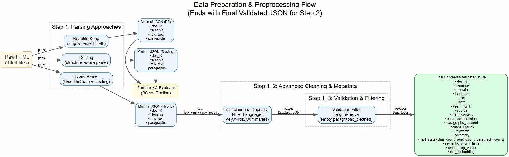
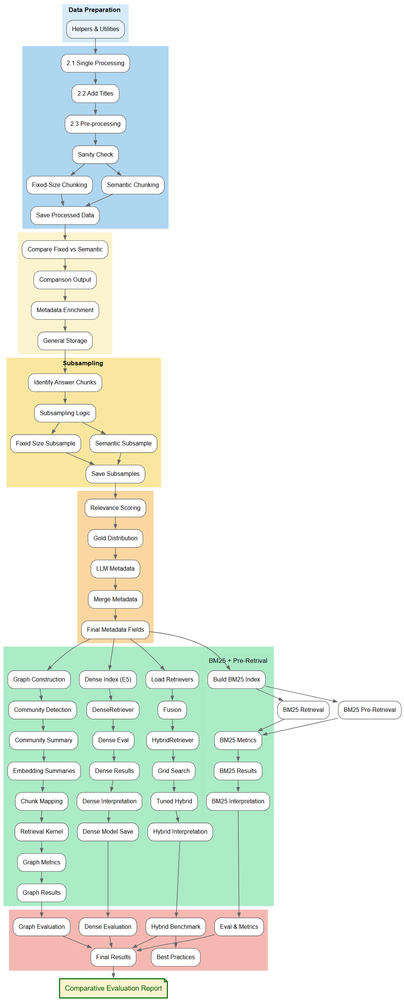
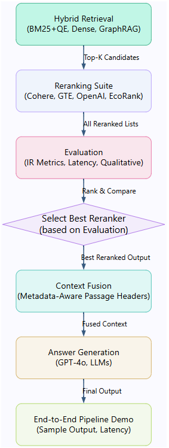
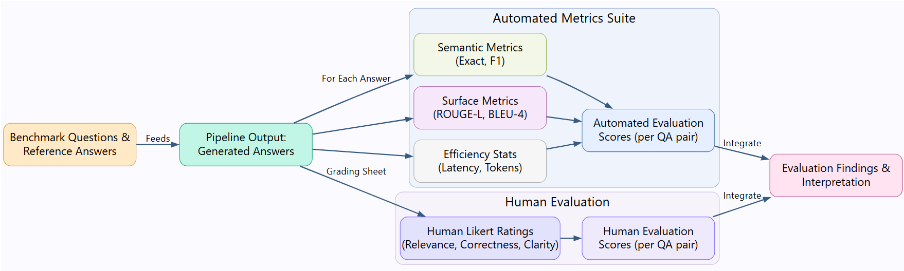

# Advanced Generative AI – Retrieval‑Augmented Generation (RAG)  
*A multilingual RAG pipeline for the **ETH News** corpus*

---

## Contents
1. [Project Overview](#project-overview)  
2. [Notebooks & Phase‑by‑Phase Workflow](#notebooks--phase-by-phase-workflow)  
   - 2.1 [Step 1 – Data Preparation](#step-1--data-preparation)  
   - 2.2 [Step 2.1 – Retrieval Agents](#step-21--retrieval-agents)  
   - 2.3 [Step 2.2 – Reranking & Answer Synthesis](#step-22--reranking--answer-synthesis)  
   - 2.4 [Step 3 – Evaluation](#step-3--evaluation)  
3. [Quick Start](#quick-start)  
4. [Repository Structure](#repository-structure)  

---

## Project Overview
This semester project demonstrates an **end‑to‑end, multilingual Retrieval‑Augmented Generation system**.  
Starting from raw HTML articles, the pipeline:

1. Cleans, parses and enriches data with rich metadata  
2. Experiments with multiple retrieval strategies (BM25, dense, graph‑based and hybrid)  
3. Applies model‑agnostic reranking and context‑fusion to craft an LLM prompt  
4. Evaluates answers automatically **and** with human raters  

For full details and deliverables, please refer to the official **[Project Requirements.pdf](https://github.com/andrigerber/Adv_GenAI/blob/main/Project%20Requirements.pdf)** provided in the course materials.

Everything can be executed locally or in Google Colab.

---

## Notebooks & Phase‑by‑Phase Workflow

### Step 1 – Data Preparation
> *Notebook:* **[`Step_1.ipynb`](https://github.com/andrigerber/Adv_GenAI/blob/main/Step_1.ipynb)**



**Goal:** transform bilingual ETH News HTML files into validated JSON ready for chunking and indexing.  
Key points

| Task | Script | Highlights |
|------|--------|------------|
| **HTML parsing** | `step_1_BeautifulSoup.py`, `step_1_Docling.py`, `step_1_hybrid.py` | Compare *BeautifulSoup* (fast tag‑stripping) vs. *Docling* (layout‑aware) vs. a hybrid of both |
| **Advanced cleaning & metadata** | `step_1_2_advanced_cleaning_and_metadata.py` | Removes disclaimers/repeats, adds language, NER, keywords, summaries |
| **Validation** | `step_1_3_validation_filter.py` | Drops empty docs, final sanity checks |

Output (one JSON per article):

```jsonc
{
  "doc_id": "9b7f…",
  "filename": "example.html",
  "domain": "ethz.ch",
  "language": "de",
  "date": "2023-05-01",
  "source": "ETH News",
  "paragraphs_original": [ … ],
  "paragraphs_cleaned": [ … ],
  "named_entities": [ … ],
  "keywords": [ … ],
  "summary": "…",
  "text_stats": { "char_count": 864, "word_count": 128, "paragraph_count": 1 }
}
```

---

### Step 2.1 – Retrieval Agents
> *Notebook:* **[`Step_2_1.ipynb`](https://github.com/andrigerber/Adv_GenAI/blob/main/Step_2_1.ipynb)**



**Goal:** create document chunks, build multiple indices, and benchmark retrieval quality.

* **Chunking:** fixed‑size (~512 tokens) *vs.* semantic segmentation  
* **Indices:** bilingual BM25, multilingual‑E5 dense vectors, **GraphRAG** entity graph  
* **Hybrid fusion:** weighted‑sum, z‑score or RRF — best mix ≈ 30% BM25/ 10% dense / 60% GraphRAG (MRR ≈ 0.78)  

---

### Step 2.2 – Reranking & Answer Synthesis
> *Notebook:* **[`Step_2_2.ipynb`](https://github.com/andrigerber/Adv_GenAI/blob/main/Step_2_2.ipynb)**



Pipeline:

1. **Hybrid retrieval** → top‑k candidates  
2. **Reranking suite** (Cohere‑rerank, GTE, OpenAI, EcoRank)  
3. **Evaluation** (IR metrics, latency, qualitative) → pick best reranker  
4. **Context fusion** with metadata‑aware headers  
5. **Answer generation** using GPT‑4o (or any LLM)  

---

### Step 3 – Evaluation
> *Notebook:* **[`Step_3.ipynb`](https://github.com/andrigerber/Adv_GenAI/blob/main/Step_3.ipynb)**



* **Automated metrics:**  
  * Semantic Exact / F1 (embedding match)  
  * ROUGE‑L, BLEU‑4  
  * Efficiency (latency, tokens)  
* **Human evaluation:** Likert ratings for *relevance, correctness, clarity*  
* **Integration:** both score sets are combined into the final **Comparative Evaluation Report**.

Average **semantic F1 = 0.36**; human graders rate clarity highest, relevance slightly lower.

---

## Quick Start

```bash
# 1️⃣  Create and activate venv
python -m venv .venv && source .venv/bin/activate        # Windows: .venv\Scripts\activate

# 2️⃣  Install core libraries
pip install -r requirements.txt                          # contains bs4, docling, spacy, nltk, etc.
# Or core libs
pip install bs4
pip install docling
pip install dateparser
pip install yake
pip install lingua-language-detector
pip install spacy
pip install nltk

# 3️⃣  Download spaCy models and NLTK data
python -m spacy download en_core_web_sm
python -m spacy download de_core_news_sm
python -m spacy download fr_core_news_sm
python -m spacy download it_core_news_sm
python -m nltk.downloader punkt
python -m nltk.downloader punkt_tab

# 4️⃣  Parse & clean HTML   (choose one parser or run all)
python Code/step_1_BeautifulSoup.py    data/ data_cleaned/BS
python Code/step_1_Docling.py          data/ data_cleaned/D
python Code/step_1_hybrid.py           data/ data_cleaned/BSD

# 5️⃣  Advanced cleaning & validation
python Code/step_1_2_advanced_cleaning_and_metadata.py   data_cleaned/BSD data_cleaned/BSD_advanced
python Code/step_1_3_validation_filter.py                data_cleaned/BSD_advanced data_cleaned/BSD_validated

# 6️⃣  Explore the notebooks 🔬
jupyter lab
```

*(Google Colab users can simply open each notebook and run all cells; mount your drive and point the data path accordingly.)*

---

## Repository Structure
```
benchmark/      # Q&A datasets & relevance labels
Code/           # Stand‑alone Python scripts
data/           # Raw HTML (not committed)
data_cleaned/   # Parsed & validated JSON
notebooks/
  ├─ Step_1.ipynb
  ├─ Step_2_1.ipynb
  ├─ Step_2_2.ipynb
  └─ Step_3.ipynb
pictures/       # All figures used in the README
```

   > **Note:** Copy the **HKNews** dataset into `data/` before running Step 1.
   >>
---

### Why this project?
- **Multilingual focus:** German & English (extendable to other languages)  
- **Hybrid retrieval:** combines lexical, dense, and graph semantics  
- **Rigorous evaluation:** automated + human for a 360° view  
- **Reproducible:** each stage is scripted and can be swapped for your own data