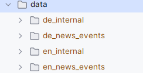

# Adv_GenAI

A repository for advanced generative AI project focused on building a Retrieval-Augmented Generation (RAG) system.
In code folder are specifc skripts run locally to suplement a bigger project on google collab.

# Advanced Generative AI Project: Retrieval-Augmented Generation (RAG) System

**Note:** Copy the **HKNews** data in the data folder:


## Step 1 Data Preparation – Structuring the Dataset
**Objective:** Prepare a structured dataset of German and English news articles by extracting and cleaning text from HTML files, enriching it with language metadata and sources, and storing it in a format suitable for retrieval in a RAG system.
**Loading, Parsing, and Cleaning HTML Files (5 Points)**

**Environment Setup:**
```bash
.venv\Scripts\activate
```

**Install:**
```bash
.venv\Scripts\activate
# Core libs
pip install bs4
pip install docling
pip install dateparser
pip install yake
pip install lingua-language-detector
pip install spacy
pip install nltk
python -m nltk.downloader punkt
python -m nltk.downloader punkt_tab


# For spaCy NER in German & English etc, also download the models:
python -m spacy download en_core_web_sm
python -m spacy download de_core_news_sm
python -m spacy download fr_core_news_sm
python -m spacy download it_core_news_sm
```

1. Use [BeautifulSoup](https://beautiful-soup-4.readthedocs.io/en/latest/) to extract raw text from .html files while removing unnecessary elements such as JavaScript, CSS, or HTML tags.

**Run:**
```bash
python Code/step_1_BeautifulSoup.py data data_cleaned/data_cleaned_BS
```
2. Use [Docling](https://github.com/docling-project/docling) for advanced document parsing, especially if handling potentially complex layouts, tables or non-standard structures

**Run:**
```bash
python python Code/step_1_Docling.py data data_cleaned/data_cleaned_D
```

3. Implement a hybrid approach (BeautifulSoup + Docling) to compare the effectiveness of both tools and optimize extraction quality.

**Run:**
```bash
python Code/step_1_hybrid.py data data_cleaned/data_cleaned_BSD
```

**Multilingual Text Preprocessing and Cleaning (5 points)**

  1. Perform necessary text preprocessing (e.g., removing extra spaces and redundant line breaks, normalizing Unicode characters, standardizing date formats from different sources), and handle German-specific text processing (e.g., compound words, umlaut normalization if needed) .
  2. Store the cleaned text and its metadata in a structured format suitable for retrieval (e.g., JSON, CSV, or a database) with fields such as language, title, date, source, main content, named entities, topics, keywords, summary.
  3. Create additional rich metadata that can support future semantic search and context filtering to enhance document retrieval later, and store metadata in a structured database (e.g., SQLite, Pandas DataFrame, or JSON format) for efficient access.

We add metadata to the cleaned data, including:
```json
{
 "doc_id": "9b7f034dc9cd5fd1b...",
 "filename": "example.html",
 "domain": "ethz.ch",                   // domain of the website here always "ethz.ch"
 "language": "de",
 "title": "",                           // not implemented
 "date": "2023-05-01",                  // always YYYY-MM-01
 "year": 2023,
 "month": 5,
 "source": "ETH News",                  // always ETH News

 "main_content": "Margrit Leuthold has been the Executive ...",
 "paragraphs_original": [
    "## About the author",
        "Margrit Leuthold has been the Executive ...",
        "## Subscribe to Newsletter",
        "Subscribe to the Newsletter for internal news",
        "## Staffnet",
        "Info portal for employees ..."
],
 "paragraphs_cleaned": [
   "Margrit Leuthold has been the Executive ...",
   "... cleaned paragraph 2 if any ..."
 ],

 "named_entities": [
   {"text": "Margrit Leuthold", "label": "PERSON"},
   {"text": "ETH Zurich", "label": "ORG"}
 ],
 "keywords": ["Margrit Leuthold", "Bangalore", "Executive Director"],
 "summary": "Margrit Leuthold has been the Executive Director ...",
 "text_stats": {
   "char_count": 864,
    "word_count": 128,
    "paragraph_count": 1
 },
 "semantic_chunk_hints": [
   {"type": "paragraph_boundaries", "count": 1}
 ],
 "embedding_vector": [], // for later
 "doc_embedding": []     // for later
}
```

**Validation Drop Empty cleaned paragraphs**
**Run:**
```bash
python Code/step_1_3_validation_filter.py data_cleaned/BSD_advanced data_cleaned/BSD_advanced_validated
```


